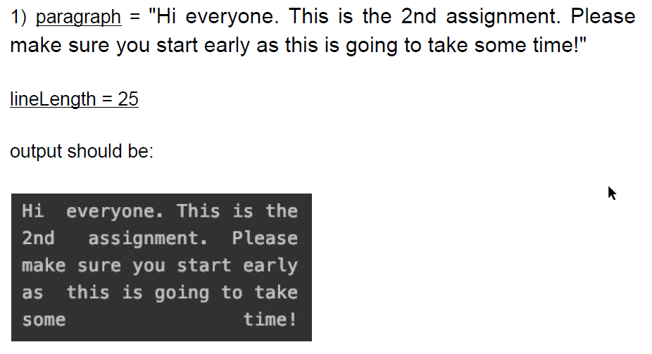

# C-projects-and-assignments
A selection of projects I have performed in C that showcase different topics.
# Project List
## linked-lists
The objective of this assignment was to create and manipulate a one-way linked list for a number of edge cases.

## tokenize
The objective of this assignment was to manually write a tokenization function that allows formatting/justifying a string.

It will allow for specification of line length, then will justify and evenly space the results to fit in the following format.

## shell
During this assignment, I created a POSIX-based Linux shell in C.

It was capable of performing the following functions:

**Reading commands**

Commands are read from stdin. An empty command should not report an error.

**Separating commands**

Any non-empty read is separated into commands. Only simple commands are supported. A simple command is a single program name with optional arguments and optional I/O redirection.

Some commands are invalid, such as a command that starts with ;

**Parsing commands**

Commands should be separated into:
- Program to run
- Arguments to the program
- stdin redirection
- stdout redirection
- stderr redirection

Redirection can include the ~ directory which will be expanded to the users home directory.

Refer to README.md and testing.pdf in shell folder for further information.

## udp-tester
During this assignment, I created a POSIX-based UDP packet testing utility. It can be provided
with input parameters to send packets with various configurations (size, number of packets, delay time) between a client and server program.
Once the transmission is complete, a log file is generated that can be parsed by the log parser program to
produce statistics on packet transmission (packet loss, packet corruption).

Refer to report.pdf for details.