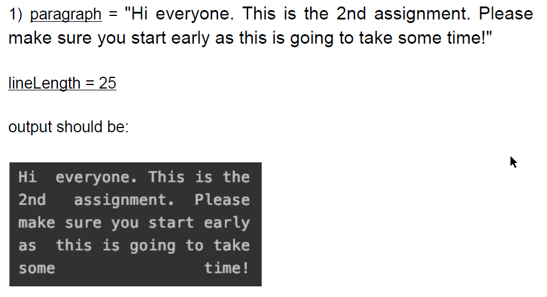

# linked-lists
The objective of this assignment was to manually write a tokenization function that allows formatting/justifying a string.

It will allow for specification of line length, then will justify and evenly space the results to fit in the following format.

